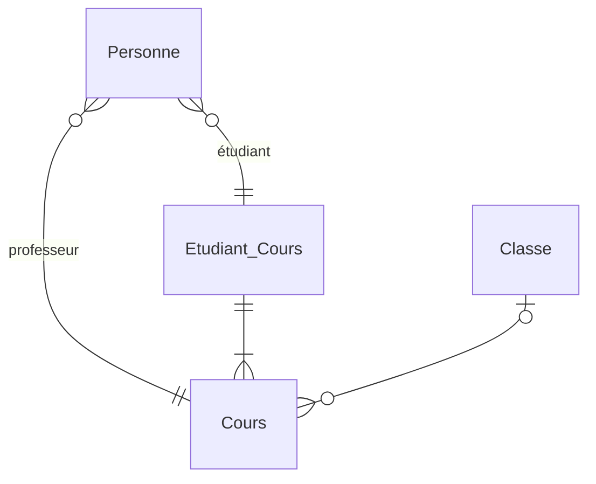
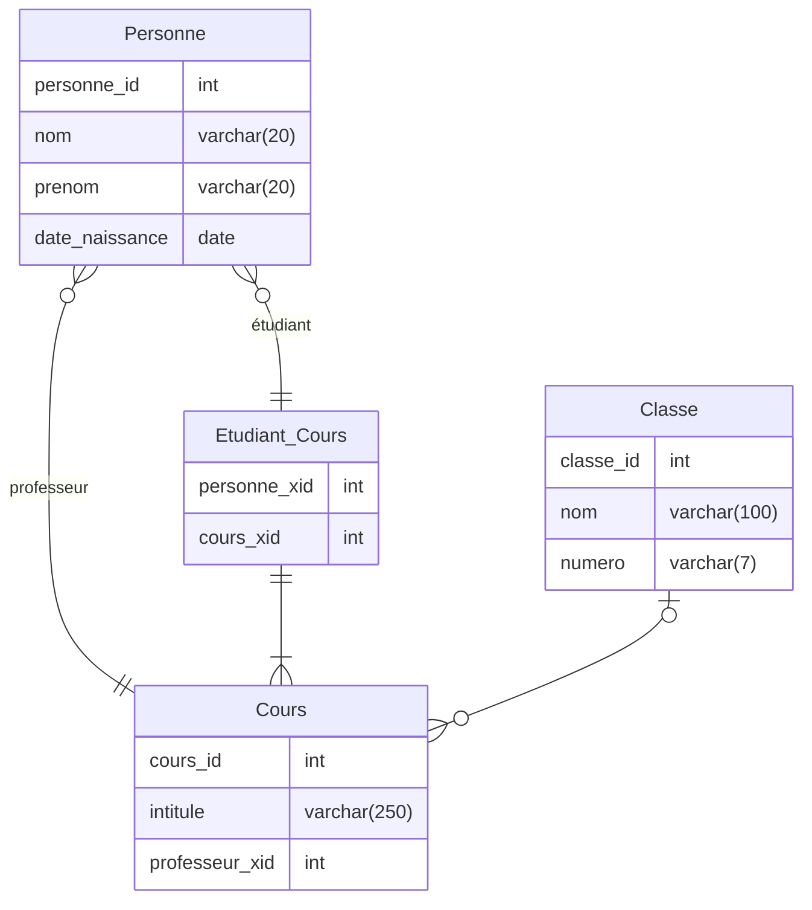
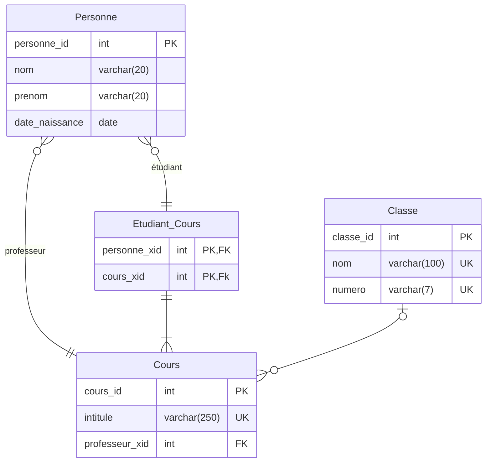
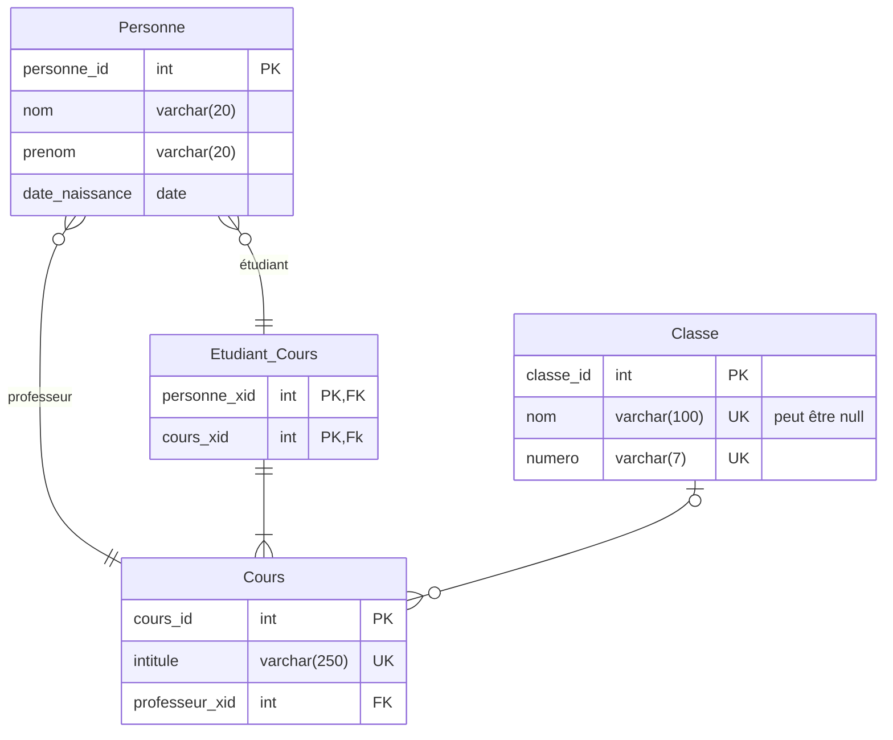

Pour le MPD, je vais utiliser Mermaid, bien que j'aime la flexibilité d'Excalidraw, pour passer écrire un modéle physique de données, il serait devenu trop lourd, là où Mermaid est plus souple.

Mermaid est un language qui permet de décrire des diagrammes et qui va vous le "dessiner" pour vous.
L'avantage c'est qu'il s'adapte automatiquement au changement effectuer.

Mermaid est implémenter dans Notion et dans Obsidian ce qui est un autre avantage.

## Utiliser Mermaid

Vous pouvez éditer Mermaid via [simplemermaid.com](https://www.simplemermaid.com/mermaid-tool.html)

La doc pour Mermaid est disponible sur le site de Mermaid: [mermaid.js.org](https://mermaid.js.org/syntax/entityRelationshipDiagram.html)

Pour illustrer mes exemples, je vais partir du MLD de notre gestion d'étudiant.

## Passage du MLD au MPD

Pour illustrer mes exemples, je vais utiliser le MLD de notre gestion d'étudiant.

![[MLD to MPD.excalidraw.svg]]
%%[[MLD to MPD.excalidraw.md|🖋 Edit in Excalidraw]]%%

## erDiagram

La première chose, qu'il faut faire c'est dire à Mermaid quel est le type de diagramme que vous voulez utiliser.

Mermaid vient avec toute sorte de diagram (diagramme de classe, diagramme de flux, diagramme de séquence, ...)

Dans notre cas, on souhaite faire un erDiagram (entity relation diagram)

donc en en-tête de votre code, écrivez `erDiagram`

## Tables

Pour commencer à écrire une table, il vous suffit de la nommer.

Ici on a 4 tables: `Personne`,  `Etudiant_Cours`,  `Classe`,  `Cours`
donc je vais écrire:

```
erDiagram

Personne

Etudiant_Cours

Classe

Cours
```

ce qui va donner:


Ne vous inquiétez pas, les tables vont se remplir. 
## Relations

Pour décrire les relation entre les tables on va décrire les relation

Pour décrire une relation on va écrire les deux tables et entre les deux on va écrire le code pour la relation

Avant d'encoder nos relations, parlons d'abord des cardinalités.

il y a 4 types de cardinalités, chacune sera symbolisé différemment.

| cardinatités | représentations gauche | représentations droite |
| ------------ | ---------------------- | ---------------------- |
| 0, 1         | \|o                    | o\|                    |
| 1, 1         | \|\|                   | \|\|                   |
| 0, N         | }o                     | o{                     |
| 1, N         | }\|                    | \|{                    |

Et donc pour représenter une relation on écrit:
1. Le nom de la première table
2. La cardinalité (gauche)
3. `--` (deux tirets)
4. l'autre cardinalité (droit)
5. nom de la deuxième table
6. on ajoute ":"
7. description de la relation

exemple:
la relation entre `Cours` et `Classe` est une relation `1, 1` et `1, N` je vais donc écrire: 
`Cours ||--o{ Classe : ""`

Ici je ne souhaite pas décrire la relation, je vais donc laisser une chaîne de caractères vide.

Pour la relation entre `Personne` et Cours, qui est une relation 0, N, 1, 1, là je vais me fendre d'une description pour clarifier la situation:

`Personne }o--|| Cours : "professeur"`

Mon diagramme avec toute les relations écrites donnerai quelque chose comme ceci:

```
erDiagram 

Personne 

Etudiant_Cours 

Classe
 
Cours

Personne }o--|| Cours: "professeur"
Personne }o--|| Etudiant_Cours: "étudiant"
Etudiant_Cours ||--|{ Cours: ""
Classe |o--o{ Cours: ""
```



Vous aurez remarqué que la manière de décrire les cardinalité est différente, c'est une manière plus anglophone de le faire, et aussi plus graphique.

## Les Champs

Il nous reste à décrire nos champs et leur type.
Commençons par les nommer.

Pour chaque table on va ajouter des accolades et écrire un nom champ par ligne suivit du type du champ.

Ainsi la table personne deviendra [^1] 

```
Personne {
	personne_id int
	nom varchar(20)
	prenom varchar(20) 
	date_naissance date 
}
```

Notez que les indentation ne sont pas nécessaire, mais elles clarifie le code. 

Mon Diagramme donnera ceci:

```
erDiagram 

Personne {
	personne_id int
	nom varchar(20)
	prenom varchar(20) 
	date_naissance date 
} 

Etudiant_Cours {
	personne_xid int
	cours_xid int
}

Classe {
	classe_id int
	nom varchar(100)
	numero varchar(7)
}
 
Cours {
	cours_id int
	intitule varchar(250)
	professeur_xid int
}

Personne }o--|| Cours: "professeur"
Personne }o--|| Etudiant_Cours: "étudiant"
Etudiant_Cours ||--|{ Cours: ""
Classe |o--o{ Cours: ""
```



## Clé primaire et Contraintes d'intégrités

Ensuite, on va définir les clé primaires et les contraintes d'intégrité.
Derrière chaque champ vous allez indiqué si c'est une clé primaire avec un `PK` ou une clé étrangère avec un `FK` ou si il est unique `UK`.
Si une clé primaire est aussi une clé étrangère ça donnera `PK, FK`

```
erDiagram 

Personne {
	personne_id int PK
	nom varchar(20)
	prenom varchar(20) 
	date_naissance date 
} 

Etudiant_Cours {
	personne_xid int PK, FK
	cours_xid int PK, Fk
}

Classe {
	classe_id int PK
	nom varchar(100) UK
	numero varchar(7) UK
}
 
Cours {
	cours_id int PK
	intitule varchar(250) UK
	professeur_xid int FK
}

Personne }o--|| Cours: "professeur"
Personne }o--|| Etudiant_Cours: "étudiant"
Etudiant_Cours ||--|{ Cours: ""
Classe |o--o{ Cours: ""
```



[^1]: Je me suis basé sur les type de MySQL

### Commentaires

Si vous le désirez, vous pouvez ajouter un commentaire en fin de ligne et entre guillemet

exemple: `nom varchar(100) UK "peut être null"`

## Modéle physique des données

Voici notre diagramme final:

```
erDiagram 

Personne {
	personne_id int PK
	nom varchar(20)
	prenom varchar(20)
	date_naissance date
} 

Etudiant_Cours {
	personne_xid int PK, FK
	cours_xid int PK, Fk
}

Classe {
	classe_id int PK
	nom varchar(100) UK "peut être null"
	numero varchar(7) UK
}
 
Cours {
	cours_id int PK
	intitule varchar(250) UK
	professeur_xid int FK
}

Personne }o--|| Cours: "professeur"
Personne }o--|| Etudiant_Cours: "étudiant"
Etudiant_Cours ||--|{ Cours: ""
Classe |o--o{ Cours: ""
```

