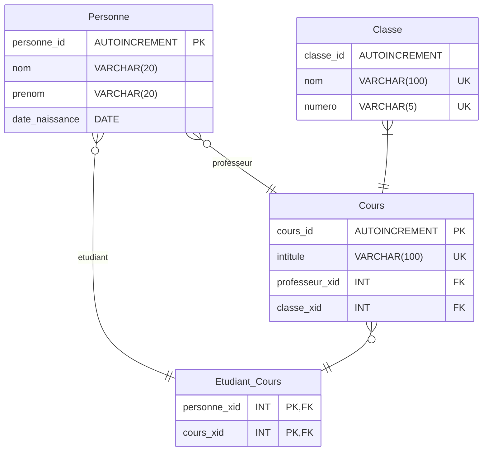

Pour illustré cette exemple, je vais me baser sur MySQL(InnoDB) .

Reprenons le MLD de notre gestion de classe et voyons ce qu'il donne en MPD

![[MLD to MRD - Part A.excalidraw.svg]]
%%[[MLD to MRD - Part A.excalidraw.md|🖋 Edit in Excalidraw]]%%

