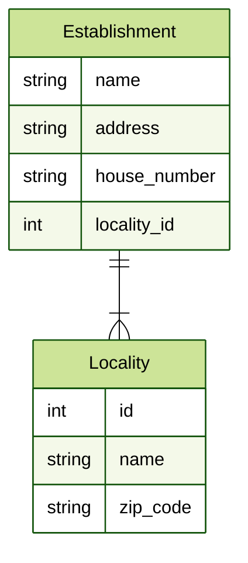

## Définitions

Une base de données est une collection organisée d'objets structurés tels que des nombres, des textes, des dates, et mais aussi d'autres objets (Fichier binaires, Info de géolocalisation, ...) pouvant être traités par des moyens informatiques pour produire une information. 

Les traitements  de ces informations sont des combinaisons de recherches, de choix, de tris, de regroupements, de concaténations, etc.
[Source: wikipedia](https://fr.wikipedia.org/wiki/Base_de_donn%C3%A9es)

## Utilité des bases de données

Les système de gestion de bases de données (SGBD) ou simplement base de données sont utiles pour deux choses.
1. Économisé de la mémoire
2. Amélioré la vitesse de traitement

### Économisé de la mémoire

Si vous prenez une le tableau de données suivantes:

| Établissement  | Adresse                 | N°    | Localité   | Code Postale |
| -------------- | ----------------------- | ----- | ---------- | ------------ |
| Interface 3    | rue Gaucheret           | 88-90 | Schaerbeek | 1030         |
| Team Panoptes  | rue d'Alost             | 7-11  | Bruxelles  | 1000         |
| Engie          | boulevard Simon Bolivar | 36    | Bruxelles  | 1000         |
| IFOSUP         | rue de la limite        | 6     | Wavre      | 1300         |
| Delhaize Limal | avenue de la gare       | 13-14 | Limal      | 1300         |
| Smartoys       | avenue des brasseries   | 30    | Wavre      | 1300         |
| Netika         | avenue Zenobe Gramme    | 27    | Wavre      | 1300         |
| MOK            | Rue Antoine Danseart    | 196   | Bruxelles  | 1000         |

Si on stocke ça dans un tel quel (dans un fichier XLSX par exemple), chaque entrées aura ~54 octets, ce qui veut dire que pour les 8 lignes ici présente cela ferait 432 octets.

Si on reformate les données en plusieurs groupes:

| ID Localité | Localité   | Code Postale |
| ----------- | ---------- | ------------ |
| 1           | Schaerbeek | 1030         |
| 2           | Bruxelles  | 1000         |
| 3           | Wavre      | 1300         |
| 4           | Limal      | 1300         |

| Établissement  | Adresse                 | N°    | Localité ID |
| -------------- | ----------------------- | ----- | ----------- |
| Interface 3    | rue Gaucheret           | 88-90 | 1           |
| Team Panoptes  | rue d'Alost             | 7-11  | 2           |
| Engie          | boulevard Simon Bolivar | 36    | 2           |
| IFOSUP         | rue de la limite        | 6     | 3           |
| Delhaize Limal | avenue de la gare       | 13-14 | 4           |
| Smartoys       | avenue des brasseries   | 30    | 3           |
| Netika         | Avenue Zenobe Gramme    | 27    | 3           |
| MOK            | Rue Antoine Danseart    | 196   | 2           |

Cette logique évite de faire des erreurs, comme par exemple avoir plusieurs orthographe pour la même ville (Exemple Bruxelles et Brussels). Mais surtout cela permet de rationalisé la place.

Dans cet exemple, on ne traite que 5 données, mais vous imaginez bien que ce qu'on a fait pour la localité peut être reproduit pour d'autres données.

### Amélioré la vitesse de traitement

Un autre avantage de structurer les données comme dans un SGBD, c'est que l'accès au données est plus rapide. 

Un exemple simple. Si les données sont ordonnées, trouver un entier dans un tableau est plus rapide que trouver une chaîne de caractère.
La raison est simple. Chaque caractère d'une chaîne correspond à un octet, donc une chaîne de caractère comme "Bruxelles" fait 9 octets.

Un entier  lui est stocké sur 4 octets[^1]. Donc, sans entrer dans les détails des algorithme de tri, la recherche sur une chaîne de caractère de plus de 4 lettres sera moins rapide que sur un entier.

Si on part de ce postulats, si la localité est stockée sous forme d'un identifiant et donc d'un entier, il sera plus rapide de regrouper les établissement se trouvant à Bruxelles que si on avait gardé nos données sous formes brutes.

## Tables

| ID Localité | Localité   | Code Postale |
| ----------- | ---------- | ------------ |
| 1           | Schaerbeek | 1030         |
| 2           | Bruxelles  | 1000         |
| 3           | Wavre      | 1300         |
| 4           | Limal      | 1300         |

| Établissement  | Adresse                 | N°    | Localité ID |
| -------------- | ----------------------- | ----- | ----------- |
| Interface 3    | rue Gaucheret           | 88-90 | 1           |
| Team Panoptes  | rue d'Alost             | 7-11  | 2           |
| Engie          | boulevard Simon Bolivar | 36    | 2           |
| IFOSUP         | rue de la limite        | 6     | 3           |
| Delhaize Limal | avenue de la gare       | 13-14 | 4           |
| Smartoys       | avenue des brasseries   | 30    | 3           |
| Netika         | Avenue Zenobe Gramme    | 27    | 3           |
| MOK            | Rue Antoine Danseart    | 196   | 2           |

Chacun des groupes de données représentés ici est appelé **table**.
Une table est une *entité* qui regroupe 1 ou plusieurs *attributs*[^2] qui seront aussi appelées **champs**.

Dans le cas qui nous occupait, nous avions deux tables
Localité et Etablissement.

Nous verrons dans la suite du cours comment interprété ce diagramme, mais une chose qui est mise en évidence dans ce schéma: la relation entre *Establishment* et *Locality*
## Relations

Les système de gestion de base de données les plus courant, sont des bases de données dîtes relationnelle.
On les appelle comme cela car différentes entités de la bases de données sont en relation entre elles, comme le sont *Establishment* et *Locality*.

Nous verrons tout au long de ce cours comment créer les tables et comment établir des relations qui font sens.

[^1]: 	En générale, pour un entier classique (`int`) la place mémoire en mémoire est de 4 octets et il peut aller de  -2.147.483.648 à 2.147.483.647. Si celui-ci n'est pas signé, ce qui veut dire qu'on n'a pas la partie négative, on peut aller jusqu'à 4.294.927.295. 

[^2]: Souvent plusieurs, soyons honnête.
