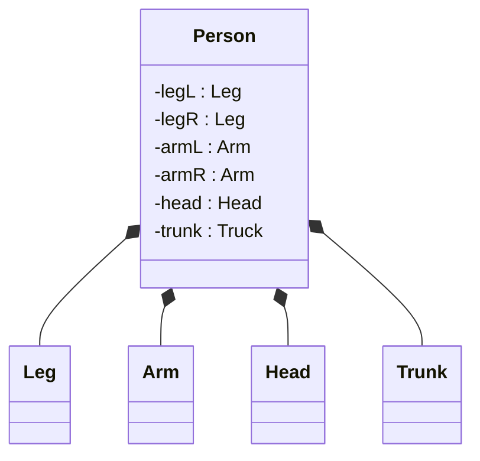
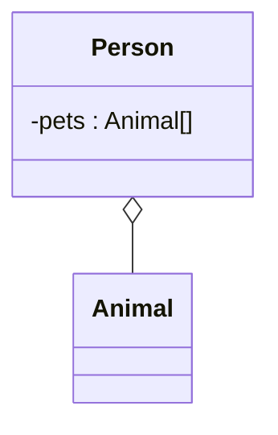
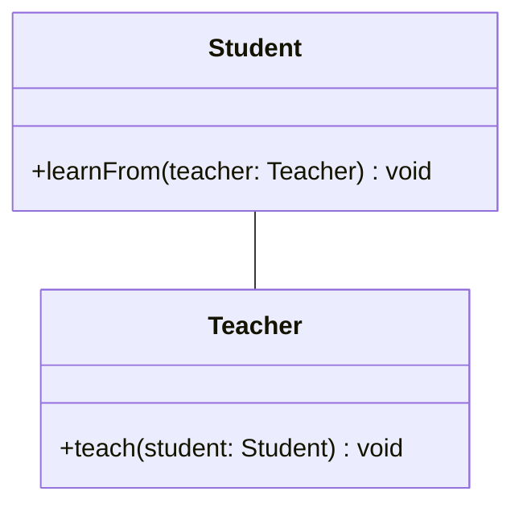
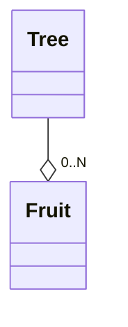
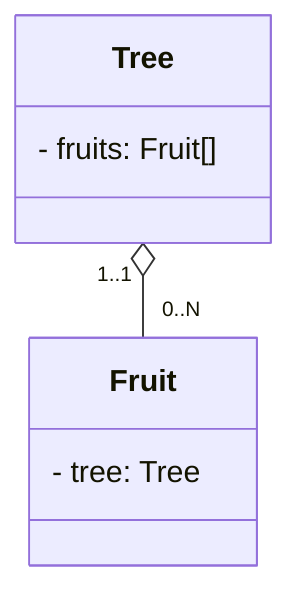

En dehors de la généralisation, il y a d'autres liens possibles pour un diagramme de classes.

Ces liens sont là pour représenté les relations entre les classes.

## Composition

Le premier lien que nous allons voir est la composition.
Une composition est la pour représenté des entités qui compose une autre entité.

Un des exemples tartes à la crème est celui de la personne. 
Une personne est composé de bras, de jambes et du tronc et d'une tête

La composition est représentée par une ligne qui fini par un diamant plein (colorié en noir). Le diamant est toujours du coté celui qui est composé de l'entité.

Ici `Person` est composé de `Leg` donc le diamant est du coté de `Person`.

Au niveau programmation, si une classe compose une autre classe, son existence est étroitement liée à la classe qu'elle compose.

Dis autrement, quand une entité disparaît, les composants de cette entité disparaissent aussi.

Par exemple, si une instance de `HumanBody` venait à disparaître, toutes les instances de `Leg` liées à ce `Person` disparaîtrait en même temps.

## Agrégation

L'agrégation est la relation qui représente un lien entre deux classes où l'une aurait un lien d'appartenance avec l'autre sans avoir dépendance sur l'existence pour pour la composition.

Imaginons notre classe `Person` qui aurait un animal de compagnie.

L'agrégation est représentée par une ligne qui fini par un diamant vide (non-colorié). Le diamant est toujours du coté celui qui possède l'entité.

Au niveau programmation les deux classes ont une vie totalement indépendante, si une entité agrègatrice disparaît, les entités qu'elle agrègeait ne disparaîtrons pas.

## Association

Un lien d'association est un lien qui implique qu'une classe utilise l'autre (dans l'une de ses méthodes). Cela veut dire qu'il y a une connection entre elles sans qu'il y ait de lien d'appartenance.

Prenons la relation entre un étudiant et un professeur. Un professeur peut enseigner à un élève et l'élève peut apprendre du professeur. Ce qui fait que l'enseignant et l'élève sont connecté. 

Un association peut être unilatérale ou bilatérale, cela ne changera rien à la symbolisation de la relation.

## Cardinalité

Les cardinalités indique le nombre concerné par liens en questions. 
La cardinalité est indiquée avec un minimun et un maximun. 
Pour les valeurs minimun on peut avoir 0, 1 ou N. N représentant plusieurs (allant de 2 à l'infini).
Pour les valeurs maxium on peut avec 1 ou N.

> [!NOTE] N, il n'y a rien de plus précis?
> Normalement à partir de 2, on notera N, mais rappelez-vous qu'il faut être avant tout pragmatique. Si on est sur d'avoir toujours 3 maximun, on peut notez 3, mais c'est assez rare et non-conventionnel.

Le maximum et le minimum sont sont indiqué séparé par deux points comme ceci "`..`".
Donc pour exprimer qu'une entité peut posséder de 1 à plusieurs éléments, on écrira "`1..N`"

Enfin, en UML, la cardinalité se trouve du coté qui est concerné par la possession. 

Par exemple, si on veut exprimer la relation entre un arbre et ses fruit, l'arbre pouvant posséder plusieurs fruit.  La relation sera de `0..N` (car un arbre peut ne pas avoir de fruit) et on notera la relation au niveau du fruit .

Et la relation entre le fruit et sont arbre sera de `1..1` et sera indiquée au niveau de l'arbre.

