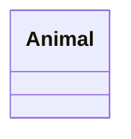
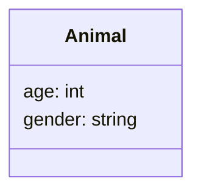
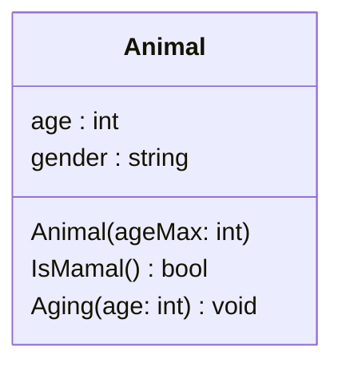
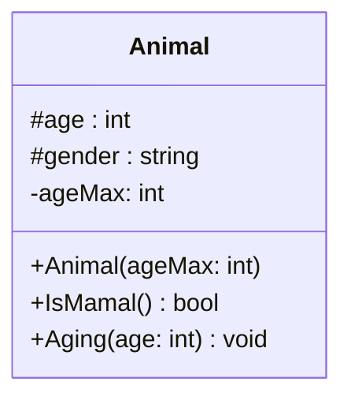

L'un des piliers de l'orienté objet sont les classes et leur mécanisme d'héritage.

Il est très facile de se perdre dans l'arborescence des classes et dans la manière dont celles-ci interagissent entre-elles.

Il est donc bon d'avoir une vue de l'architecture global de toutes les classes d'un même programme.

C'est là que le diagramme de classes intervient.
Pour les programmeur·euse·s, c'est sans doute l'un des diagrammes les plus utilisés (avec le diagramme de séquence).

## Représenter une classe

Chaque classe sera représentée avec un rectangle avec le nom de la classe en en-tête.
Voici donc la classe "Animal".



Vous remarquerez qu'elle est divisé en 3 rectangles un avec le nom et deux encore vide qui seront pour les attributs et les méthodes de la classes.

### Attributs

Les attributs d'une classe sont écrit dans le rectangle du haut.

Pour chaque attribut, on va écrire "`:`" suivit du type attendu.



### Méthodes

Les méthodes d'une classe sont décrites dans le rectangle du bas. 

Pour les arguments, on les mettra entre parenthèses, avec le type attendu (comme pour les attributs) 

Pour le retour, on le mettra en fin de déclaration de la même façon que pour les types d'attributs. 

Si il n'y a pas de retour, le type attendu sera `void`[^1]


> [!NOTE] Constructeur
> Le constructeur n'a pas de retour et on ne va pas le spécifier non-plus car c'est tacite (et que ça permet de le repérer plus facilement).



### Accessibilité

En programmation orienté objet, il y a 3 niveaux accessibilités principaux. 
- **private** : pour ce qui n'est accessible qu'au sein de la classe. 
- **protected** : pour ce qui n'est accessible qu'au sein de la classe et à ses enfants.
- **public** : pour ce qui n'est accessible à tout les éléments du programme

Dans le diagramme de classe, on précédera chaque élément d'un symbole pour établir son accessibilité.

- les éléments **private** seront précédés d'un "-"
- les éléments **protected** seront précédés d'un "#"
- les éléments **public** seront précédés d'un "+"





Fort de cette connaissance, faite la représentation de la classe suivante:


> [!NOTE] Typage en Python
> En python, le typage est dynamique. Mais il existe un moyen donner une indication sur le typage attendu aux développeur·euse·s qui utilisent vos classes ou vos fonctions.
> 
> Pour les arguments, vous écrivez "`:`" suivit du type attendu (comme pour le diagramme de classe). 
> 
> Pour le retour, on va écrire "`->`" suivit du type attendu. Cette annotation viendra se placer entre la parenthèse fermante et les "`:`"
```python
class Vehicle:

	def __init__(self, speed: float):
		self._speed = speed
		self._distance = 0
	
	def ride(self, duration: float)-> None:
		travel = duration * self.speed
		self.distance += travel
```

[^1]: "vide" en anglais.
