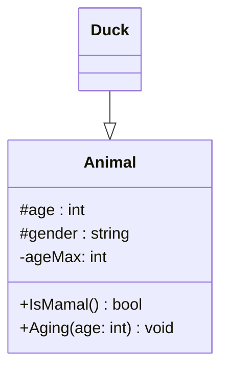
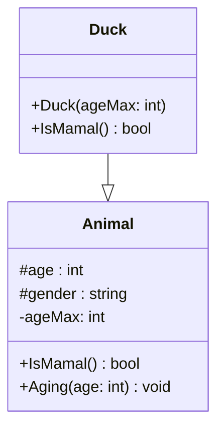

## Généralisation
Pour symboliser l'héritage nous utiliserons une flèche avec une pointe en triangle vide (non-coloré).

Le sens de la flèche va du spécifique au générale (ou de l'enfant au parent). On appelle ce type de lien, une généralisation.

En l'état le diagramme indique que la classe `Duck` hérite de `Animal`.

## Redéfinition

Si je veux indiquer qu'une redéfinition existe, on récrira la méthode dans la classe enfant pour indiquer qu'elle est redéfinie.

> [!Attention] Rappel
> Pour qu'une méthode puisse être redéfinie, elle ne peut pas être privée. Elle doit être publique ou protégée.

Maintenant, écrivez le diagramme de classes de l' [[Exercices - Héritages|exercice exercice sur les trains]], en incluant aussi la [[Héritage#^e73fae|voiture]] et le [[Héritage#^5932fc|vélo]].

