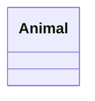
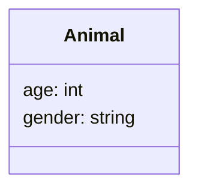
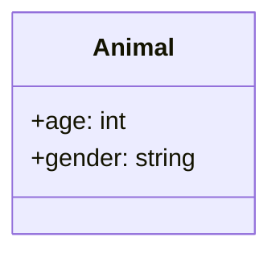

L'un des piliers de l'orienté objet sont les classes et leur mécanisme d'héritage.

Il est très facile de se perdre dans l'arborescence des classes et dans la manière dont celles-ci interagissent entre-elles.

Il est donc bon d'avoir une vue de l'architecture global de toutes les classes d'un même programme.

C'est là que le diagramme de classes intervient.
Pour les programmeur·euse·s, c'est sans doute l'un des diagrammes les plus utilisés (avec le diagramme de séquence).

## Représenter une classe

Chaque classe sera représentée avec un rectangle avec le nom de la classe en en-tête.
Voici donc la classe "Animal".

Vous remarquerez qu'elle est divisé en 3 rectangles un avec le nom et deux encore vide qui seront pour les attributs et les méthodes de la classes.

### Attributs

Les attributs d'une classe sont écrit dans le rectangle du haut.

### Méthodes

L

### Accessibilité

En programmation orienté objet, il y a 3 niveaux accessibilités principaux. 
- **private** : pour ce qui n'est accessible qu'au sein de la classe. 
- **protected** : pour ce qui n'est accessible qu'au sein de la classe et à ses enfants.
- **public** : pour ce qui n'est accessible à tout les éléments du programme

Dans le diagramme de classe, on précédera chaque élément d'un symbole pour établir son accessibilité.

- les éléments **private** seront précédés d'un "-"
- les éléments **protected** seront précédés d'un "#"
- les éléments **public** seront précédés d'un "+"

