Flow chart en anglais.

Le diagramme de flux n'est pas vraiment un diagramme UML à proprement, mais il en a inspiré quelques-uns et même si ce n'est pas de l'UML, il est important de savoir le lire.

## Début et fin

Un programme toujours un début et une fin qui sont représenté par deux cercles (un pour chaque extrémité du programme).

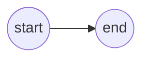
## Instruction de sortie

Une instruction de sortie est représenté par cette forme étrange censé représenté un [tube cathodique.](https://fr.wikipedia.org/wiki/Tube_cathodique)

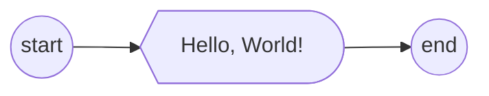

*Vous noterez aussi qu'on vient de faire le Hello World en diagramme de flux*

## Instruction d'entrée

Ce parallélogramme représente une instruction d'entrée. C'est censé représenté un clavier (nous verrons bientôt que le rectangle était déjà pris).
Si on veut exprimer que l'entrée est stockée dans une variable, celle-ci sera  exprimée à l'aide d'une flèche suivit du nom de la variable.

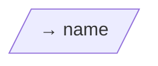


> [!Attention] Erreur récurante
> Il est fréquent qu'on oublie qu'une instruction d'entrée doit souvent ― tout le temps ― être précédée d'une instruction de sortie, afin de préciser à l'utilisateur ce qu'on attends de lui.
> En Python, `input` fait les deux en une fonction.
> 
>**Python:**
> ```python
> name = input("Quel est ton nom? )
> ``` 
> 
> **Diagramme de flux:**
> ```mermaid
> flowchart LR
> START((start))-->AskName@{ shape: curv-trap, label: "Quel est ton nom? " }
> AskName --> GetName@{ shape: lean-r, label: "→ name" }
>GetName-->END((end))
> ```


## Instruction

Une instruction classique est représentée par un rectangle

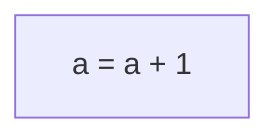

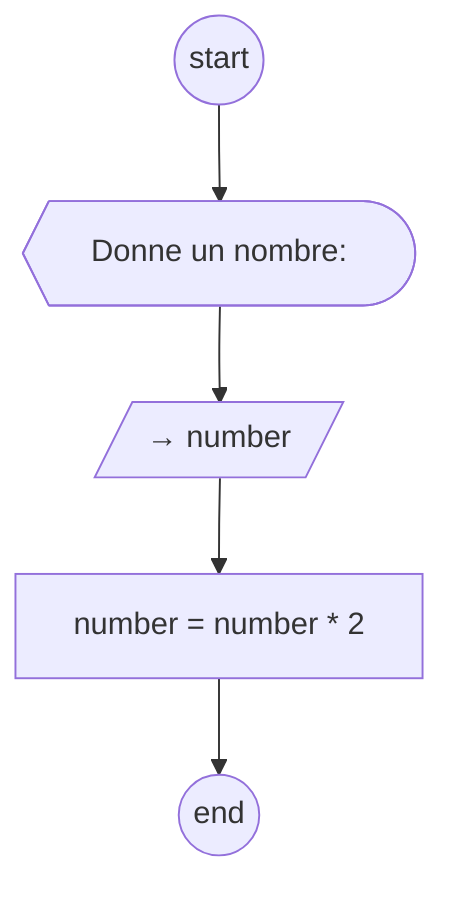

## Décision

Les décisions sont représentées par un losange.

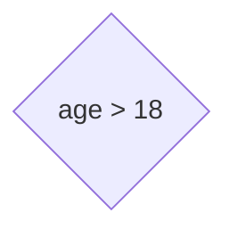

On peut les utiliser pour exprimer un `if`. Dans le code suivant par exemple.

```python
age = int(input("Quel est ton âge? "))
if age >= 18:
	print("Bienvenue en classe".)
else:
	print("Il n'y pas de cours pour toi.")
```

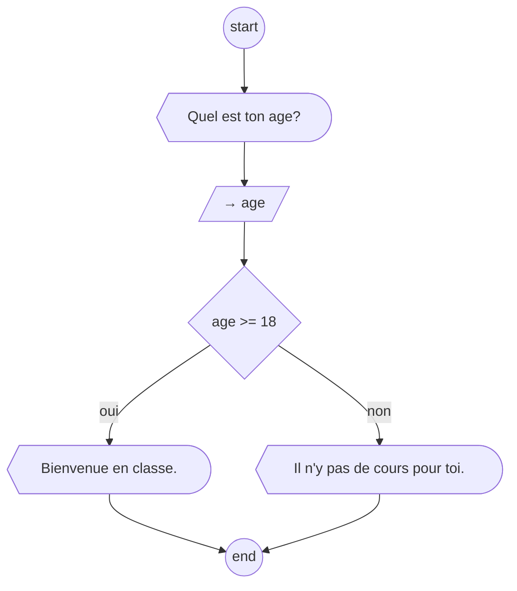

Les décisions peuvent aussi être utilisée pour exprimé un `while`, Comme dans  le code ci dessus.

```python
number = int(input("Donne un chiffre entre 1 et 10: ))

while number < 1 or number > 10:
	number = int(input("Donne un chiffre entre 1 et 10: ))
```

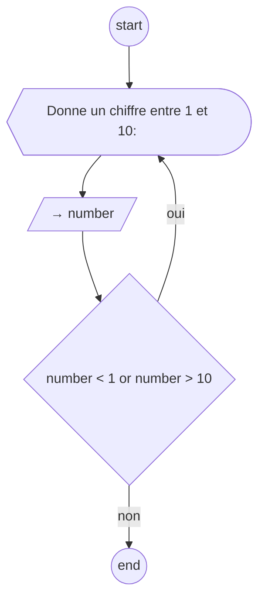
 
> [!NOTE] Ne pas en faire de trop
> Noter que dans un diagramme de flux, on ne va pas noter forcément la moindre opération, par exemple ici, on a pas spécifié la conversion (`int(...)`) car cela alourdirait le diagramme pour rien.


> [!NOTE] Décision plus lisible
> Les décisions peuvent être représentée par des hexagone allongé si cela rend le diagramme plus lisible.


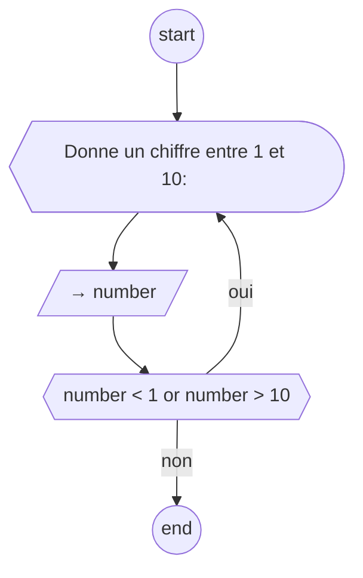


## Programme complet

Avec ces quelques instructions on peut déjà décrire beaucoup de programme.

Par exemple, voici un programme qui vérifie votre mot de passe

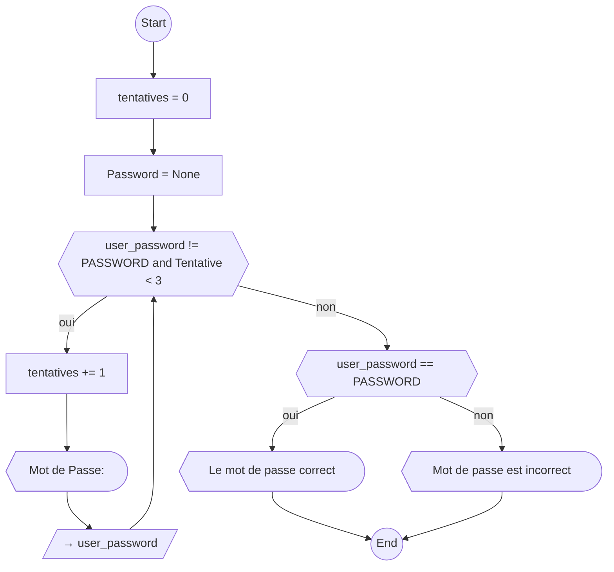

## Moins technique plus fonctionnel

Comme en témoigne ce dessin de [xkcd](https://xkcd.com), on peut faire des diagramme de flux pour plein de choses (comme expliquer comment fonctionne un diagramme de flux). 

![[xkcd_flow_charts.png]]

C'est par exemple quelque chose de fort utiliser pour expliquer les scénarios de conversation dans les entreprises de démarchage téléphonique.

Voici le programme de saisie de password expliqué à l'aide d'un flowchart, mais d'un point de vs fonctionnel.

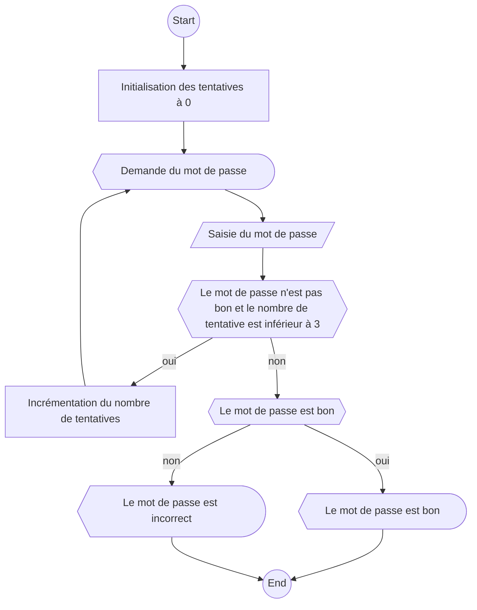

## Commentaires

Bien évidemment parfois le diagramme de flux ne suffira pas de lui même et il vous faudra ajouter des commentaires. (Tout comme dans un code classique). C'est évidemment autorisé (voir encouragé).

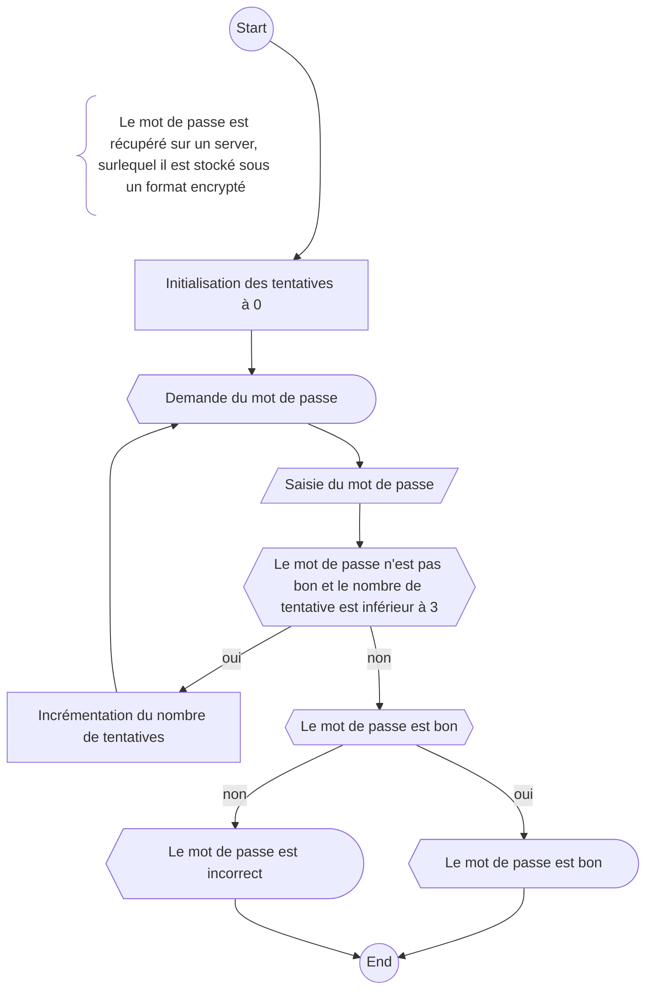

*Noté que les commentaire ne sont pas régit par une convention particulière. 
Les accolades sont dût à Mermaid, elles ne sont pas du tout obligatoires.*


## La boucle arithmétique en diagramme de flux

En tant que développeur·euse, la boucle arithmétique ou boucle *for* est un outils qu'on utilise assez régulièrement.

Le diagramme de flux est n'a pas de représentation native pour ce mécanisme, mais on peut s'en tirer relativement facilement.

Prenons le code suivant en exemple:

```python 
number = int(input("Nombre: "))

factorial = 0
for n in range(1, number+1):
	factorial += n
	
print(f"Factoriel: {factorial}")
```

On peut l'écrire sous forme de diagramme comme suit:
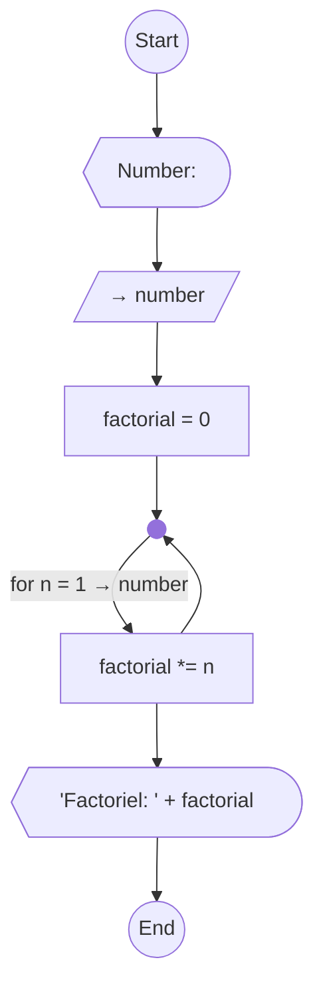

