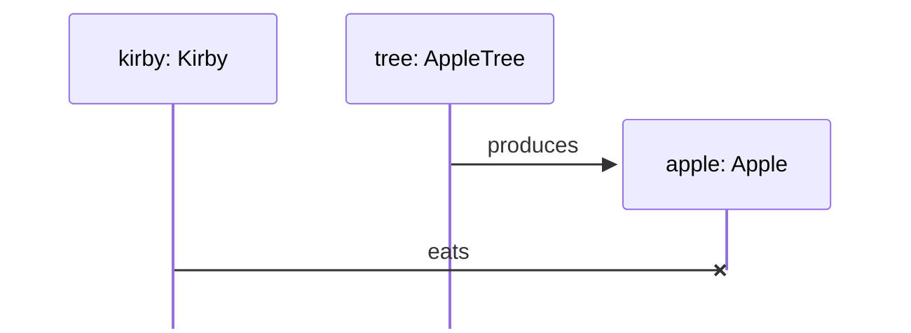
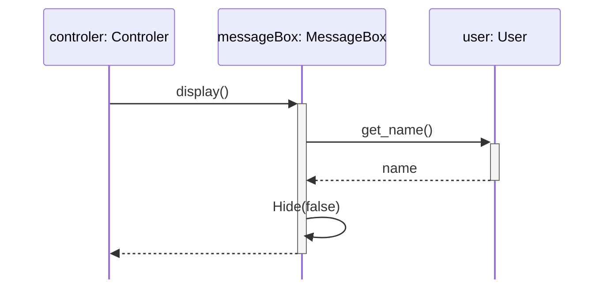
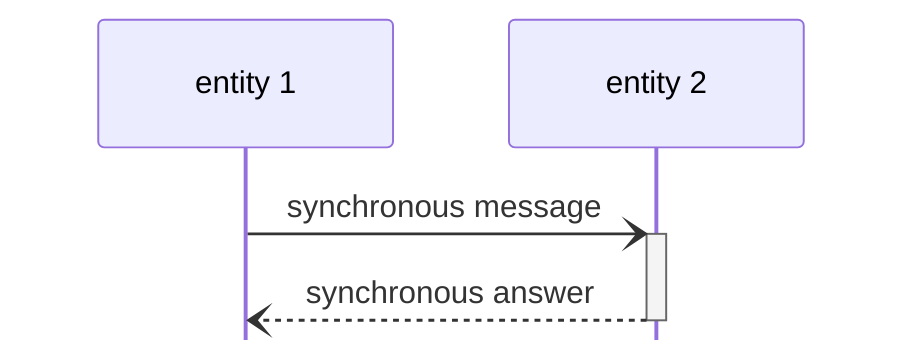
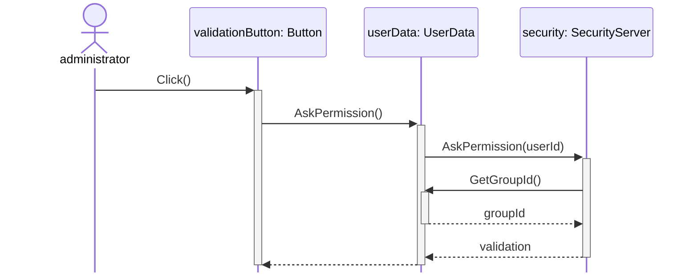
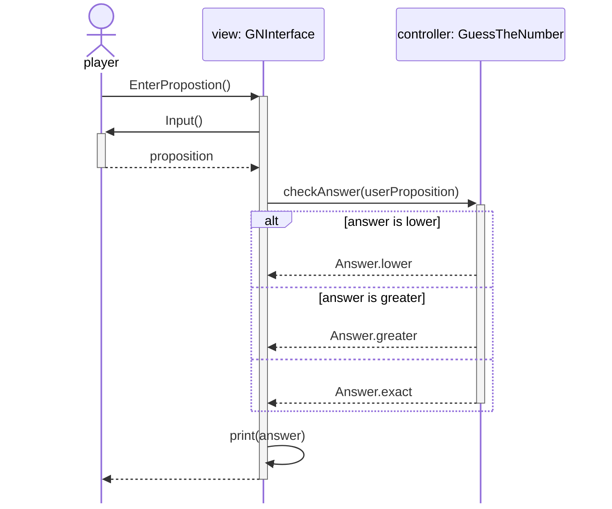
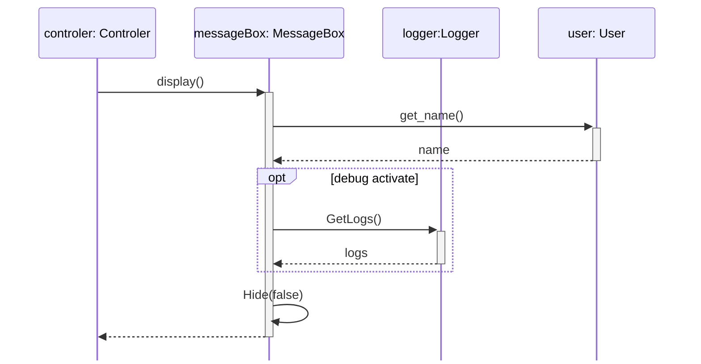
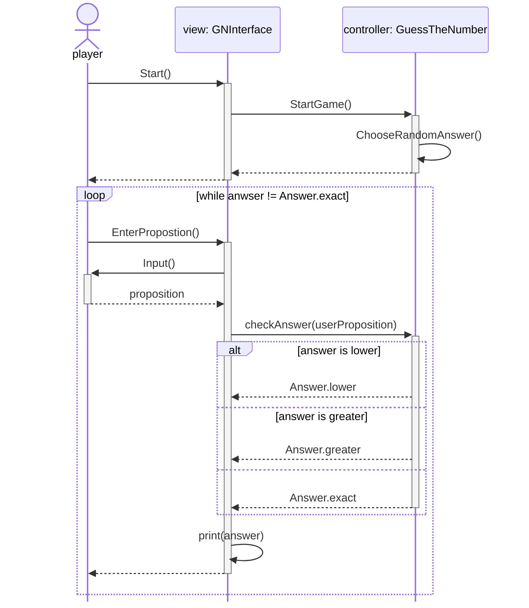

Un diagramme de séquence est un diagramme qui montre les interactions entre les entités lors d'une séquence de la vie de ces entités. Cela permet de voir qui fait quoi et qui dépend de quoi.

On utilisera ce diagramme pour représenté un morceau du code de manière très *high level*. 
Même si de la logique y est représenté, il n'est pas fait pour montrer des algorithmes complexes, pour ça nous utiliserons plutôt le [[Diagramme de flux]].

## Instance et Lignes de vie

Pour représenté les entités d'un programme, on les représentera par un rectangle dans lequel on notera sont nom suivit d'un ":" et de la classe dont elle est l'instance.

Chaque entité aura une ligne de vie, qui montre quand elle commence à exister et quand elle s'arrête d'exister.

Voici un exemple de diagramme de séquence où l'on voit que `apple` est créer par `tree` et détruit par `kirby`.

## Messages

Les interactions entre les entités seront représentées par des flêches.
Comme on peut le voir avec le diagramme si dessus, les messages partent d'une ligne de vie, vers une autre.

Chaque message peut avoir une réponse. Par exemple si une fonction a un retour. La fonction sera le message et la réponse sera le retour.

%%

Mermaid crée une erreur sur le site donc j'ai créer un image en attendant
%%
![[diagram_sequence_version_problem.png]]

Dans ce diagramme on peut voir qu'il est totalement possible qu'une entité s'envoie un message. Ici `messageBox` envoie le message `Hide` a elle-même. 

Aussi, les lignes de vie d'une entité deviennent des rectangles lorsqu'un message leur est envoyé jusqu'au moment où la réponse est retournée. On appelle ça une activation, car l'entité en question est en train de traiter le message.

La réponse peut ne pas contenir d'information (comme une fonction qui retourne `None` ou `void`).

### Synchrone et asynchrone

Il y a deux type de messages possibles:
- Des messages synchrone, qui suivent le cours du programme
- Des messages asynchrones qui eut sont sur des *thread* parallèles et qui donc ne seront pas assujetti à la procédure principale.

Les messages synchrones sont représentés par des flêches pleines

Les messages asynchrones eut sont représenté par des flêches en batons

Notez que la réponse est du même type que le message.

### Activations multiples

Dans ce diagramme de séquence, on voit que `userData` est activé plusieurs fois. Une fois pour par `validationButton` et une autre par `security`. Comme ce sont deux activation distinct, on les représentes l'une sur l'autre.

## Acteur

Dans le diagramme précédent, on constate qu'il y a une "entité" particulière représentée par un petit personnage en batons. C'est la représentation d'un acteur.

Il arrive souvent qu'un acteur (un utilisateur) soit le déclencheur de la séquence que l'on veut représenter.

## Alt-ernative

Pour représenter une décision, le diagramme de séquence offre l'alternative et l'option.
L'alternative représente le faite d'avoir plusieurs options. L'alternative est représenté par un bloc `alt`

Le text entre crochet (comme `[answer is lower]`) est nommé gardien, car il représente la condition pour rentrer dans l'option désignée par la sous-partie.

Par exemple, ici on explique que si la réponse est plus petite on renvoie `Answer.lower`, sinon si la réponse est plus grande on renvoie `Anwser.greater` et sinon on renvoie `Answer.exact`.
L'absence de gardien marque le faite que c'est l'option par défaut (si toutes les autres ne sont pas possible). Evidemment, il peut ne pas y avoir d'option par défaut.

## Opt-ion

Dans le même ordre d'idée que l'alternative, il y a l'option. Ce cadrant représente une seul option qui peut être réalisée ou non, comme un `alt` à un seul cadrant.

## Loop

Il est aussi possible de représenter une boucle (peut importe laquelle).

Pour ça nous avons le cadrant `loop`.

Le gardien de la `loop` représente la condition de boucle, si il est absent, cela représente une boucle infinie.