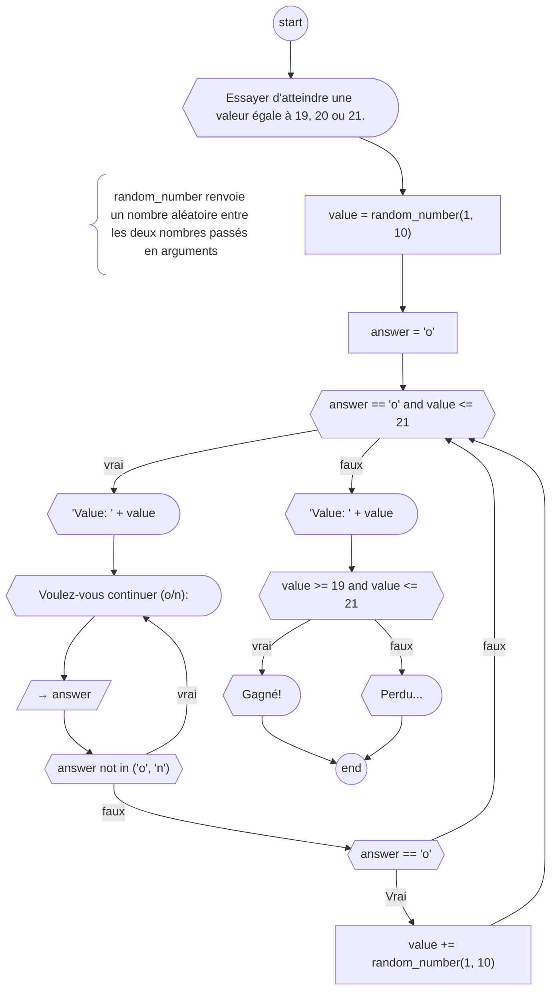

## 1. Ecrivez le diagramme de flux des code Python suivant

```python
number = int(input("Donner un nombre: "))
gr = number
lw = number

answer = input("Voulez-vous continuer (o/n): ")

while answer not in ('o', 'n'):
	answer = input("Voulez-vous continuer (o/n): ")

stop = answer == "n"

while not stop:
	number = int(input("Donner un nombre: "))
	
	if number > gr:
		gr = number
	elif number < lw:
		lw = number
		
	answer = input("Voulez-vous continuer (o/n): ")

	while answer not in ('o', 'n'):
		answer = input("Voulez-vous continuer (o/n): ")
	
	stop = answer == "n"

print(f"Le plus grand nombre entré est {gr}")
print(f"Le plus petit nombre entré est {lw}")
```

## 2. Traduisez ce diagramme de flux en code Python



## 3. Ecrivez le diagramme de flux correspondant à l'énoncé suivant:

Faites un programme pour encoder les scores d'un groupe.

Le programme demande à l'utilisateur un prénom suivit d'une demande de score.

Ensuite le programme demande à l'utilisateur si il veut continuer.

Si celui-ci dit oui il recommence à demander un nom et un score et ainsi de suite jusqu'à ce que l'utilisateur décide de dire "non" (ou "n").

Le programme donnera le nom la personne avec le meilleur score (si ex-æquo il donnera la dernière encodée avec ce score).
Enfin le programme donnera la moyenne des scores encodé.